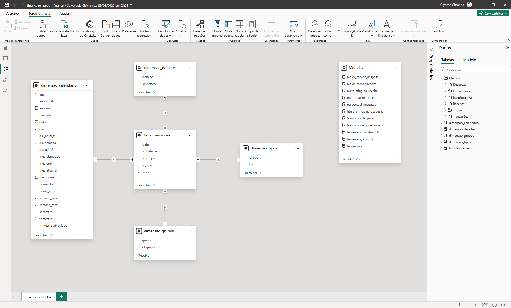

# Projeto Financeiro — Aureon Finance
  

---

Índice:
 

- 📊 [Visão Geral](#-visão-geral)
- 🧠 [Contexto do Problema](#-contexto-do-problema)
- 🎯 [Abordagem Estratégica](#-abordagem-estratégica)
- 🧠 [Metodologia Aplicada](#-metodologia-aplicada--boss-bi-framework)
- 🔷 [Fluxo da Metodologia](#-fluxo-do-boss-bi-framework)
- 📌 [Detalhamento das Etapas](#-detalhamento-das-etapas)
- 📈 [Impactos e Resultados](#-impactos-e-resultados)
- 🧩 [Estrutura do Dashboard](#-estrutura-do-dashboard)
- 📊 [Visualizações Analíticas](#-visualizações-analíticas)
- 🎛 [Filtros Interativos](#-filtros-interativos)
- 🎨 [Experiência de Navegação](#-experiência-de-navegação)
- 🛠 [Stack Técnica](#-stack-técnica)
- 🧱 [Modelagem de Dados](#-modelagem-de-dados)
- 📉 [Modelo de Dados](#-modelo-de-dados)
- 📸 [Preview do Dashboard](#-preview-do-dashboard)
- 📄 [Documentação das Medidas](#-documentação-das-medidas)
- 👤 [Autor](#-autor)

---

## 📊 Visão Geral
[← Topo](#projeto-financeiro--aureon-finance)
 

Este projeto apresenta um **dashboard de controle financeiro**, desenvolvido em Power BI, para a empresa fictícia **Aureon Finance**.

A solução permite acompanhar indicadores estratégicos de receitas, despesas, investimentos e desempenho financeiro, com análise temporal e detalhamento das transações, facilitando o controle orçamentário e a tomada de decisão baseada em dados.

🔎 **[Dashboard Interativo](https://app.powerbi.com/view?r=eyJrIjoiNDFjMzBkNzAtMmY3Zi00ZTdlLTkyMDktZmY3NzQ5Mzc5Y2NiIiwidCI6IjIzY2FjN2VlLWYxZDgtNDMzOS1hYTdiLTc4MWFhOWY5MjI1YiJ9)**  

---

## 🧠 Contexto do Problema
[← Topo](#projeto-financeiro--aureon-finance)
 

A área financeira da Aureon Finance enfrentava desafios na análise integrada de:

- receitas e entradas financeiras
- despesas operacionais e custos
- investimentos e alocação de recursos
- desempenho financeiro ao longo do tempo

Essas limitações dificultavam a identificação de padrões, tendências financeiras e possíveis desequilíbrios entre receitas e despesas, impactando diretamente o controle orçamentário e a tomada de decisão estratégica.

---

## 🎯 Abordagem Estratégica
[← Topo](#projeto-financeiro--aureon-finance)
 

Para resolver esses desafios, foi desenvolvida uma solução analítica utilizando Power BI, estruturada com modelagem dimensional e organização de indicadores estratégicos financeiros.

O dashboard foi projetado para oferecer:

- leitura executiva clara
- análise detalhada das movimentações financeiras
- navegação intuitiva entre visões consolidadas e operacionais  

### KPIs principais

- Receita Total
- Despesas Totais
- Investimentos
- Empréstimos
- Percentual de Atingimento da Meta de Receita

---

## 🧠 Metodologia Aplicada — BOSS BI Framework
[← Topo](#projeto-financeiro--aureon-finance)
 

> Este projeto foi desenvolvido utilizando o BOSS BI Framework (Business-Oriented Smart Solutions), uma metodologia proprietária desenvolvida para estruturar projetos de Business Intelligence e Analytics, focada na geração de valor estratégico, consistência analítica e suporte à tomada de decisão.

## 🔷 Fluxo do BOSS BI Framework
[← Topo](#projeto-financeiro--aureon-finance)
 

## 📌 Detalhamento das Etapas
[← Topo](#projeto-financeiro--aureon-finance)
 

### 🔹 1. Business Understanding
Definição do problema analítico e alinhamento com os objetivos estratégicos do negócio, garantindo que a solução gere valor real e mensurável.

---

### 🔹 2. Data Understanding
Mapeamento das fontes de dados e análise inicial para compreensão da estrutura, qualidade e granularidade das informações disponíveis.

---

### 🔹 3. Data Preparation
Tratamento, limpeza e transformação dos dados, assegurando consistência, padronização e confiabilidade para análise.

---

### 🔹 4. Data Modeling
Estruturação do modelo de dados utilizando boas práticas de modelagem dimensional, com foco em performance e escalabilidade.

---

### 🔹 5. Analytical Exploration
Exploração dos dados para identificação de padrões, tendências, correlações e possíveis anomalias relevantes ao negócio.

---

### 🔹 6. Data Visualization
Desenvolvimento de dashboards e relatórios interativos, aplicando princípios de visualização e Data Storytelling.

---

### 🔹 7. Insights & Decision Support
Geração de insights acionáveis e recomendações estratégicas para apoiar a tomada de decisão baseada em dados.

---

### 🔹 8. Deployment
Publicação e disponibilização da solução analítica, garantindo acesso, atualização e governança dos dados.

---

### 🔹 9. Continuous Improvement
Monitoramento contínuo e evolução da solução, adaptando-se às mudanças e novas necessidades do negócio.

---

## 📈 Impactos e Resultados
[← Topo](#projeto-financeiro--aureon-finance)
 

A solução permite:

- identificar padrões de receitas e despesas ao longo do tempo
- analisar a representatividade e concentração dos custos
- compreender a distribuição das movimentações financeiras
- comparar desempenho financeiro entre diferentes períodos

Com isso, gestores conseguem tomar decisões mais estratégicas e orientadas por dados, fortalecendo o controle financeiro e a eficiência na alocação de recursos.

---

## 🧩 Estrutura do Dashboard
[← Topo](#projeto-financeiro--aureon-finance)
 

### 📊 Indicadores Principais

O dashboard apresenta os principais indicadores financeiros:

### Receita

- valor total de receitas no período analisado  

### Despesas

- valor total de despesas consolidadas  

### Investimentos

- montante aplicado em investimentos  

### Empréstimos

- total de valores relacionados a empréstimos  

### Meta de Receita

- percentual de atingimento da meta estabelecida  

---

## 📊 Visualizações Analíticas
[← Topo](#projeto-financeiro--aureon-finance)
 

### 💰 **Receita vs Despesas | Análise Temporal**

Gráfico de barras verticais apresentando:

- comparação entre receitas e despesas ao longo do tempo  
- identificação de tendências, picos e variações financeiras  

---

### 📊 **Despesas por Categoria**

Gráfico Treemap exibindo:

- distribuição das despesas por categoria  
- impacto relativo de cada grupo de custo no total financeiro  

---

### 📅 **Evolução Financeira**

Gráfico de barras verticais mostrando:

- variação das receitas e despesas ao longo dos períodos  
- identificação de padrões e sazonalidades  

---

### 📊 **Transações | Detalhamento**

Tabela analítica apresentando:

- consolidação das movimentações financeiras  
- detalhamento por tipo de transação e valores  

---

### 📊 **Despesas | Representatividade**

Gráfico de barras ou rosca apresentando:

- percentual das despesas em relação ao total  
- visão do impacto financeiro sobre o resultado  

---

## 🎛 Filtros Interativos
[← Topo](#projeto-financeiro--aureon-finance)
 

O dashboard permite análise dinâmica por:

- **Período**

Esse filtro permite explorar diferentes cenários financeiros ao longo do tempo.

---

## 🎨 Experiência de Navegação
[← Topo](#projeto-financeiro--aureon-finance)
 

O dashboard inclui recursos de usabilidade e design:

- 🌙 **Modo Dark (padrão)**
- ☀️ **Modo Light (opcional)**
- 🔎 botão **Analisar**
- 🏠 botão **Home**

Esses elementos melhoram a experiência de exploração dos dados.

---

## 🛠 Stack Técnica
[← Topo](#projeto-financeiro--aureon-finance)
 

- Excel
- Power BI
- Power Query
- DAX (Data Analysis Expressions)
- Modelagem Dimensional
- Storytelling com Dados
- PowerPoint

---

## 🧱 Modelagem de Dados
[← Topo](#projeto-financeiro--aureon-finance)
 

⭐ **Star Schema**

Neste projeto, foi adotado o modelo Star Schema como padrão de modelagem dimensional, priorizando performance analítica, simplicidade estrutural e eficiência no processamento de dados.  

A utilização de dimensões desnormalizadas e relacionamentos diretos com a tabela fato reduz a complexidade de junções, melhora a compressão de dados no mecanismo VertiPaq e garante maior previsibilidade no comportamento dos filtros e medidas.

Essa abordagem é amplamente recomendada em soluções de Business Intelligence, especialmente no Power BI, por proporcionar melhor desempenho e facilitar a construção de análises escaláveis e intuitivas.

### **Tabelas Fato**

- transacoes

### **Tabelas Dimensão**

- calendario
- detalhes
- grupos
- tipos

Com isso, a solução proporciona maior visibilidade operacional, permitindo a identificação proativa de gargalos, melhoria no desempenho financeiro e suporte mais assertivo à tomada de decisão estratégica.

## 📉 Modelo de Dados
[← Topo](#projeto-financeiro--aureon-finance)
 

  

A modelagem foi estruturada para equilibrar normalização e desempenho, sendo possível sua adaptação para um modelo estrela em cenários que priorizem performance analítica.

---

# 📸 Preview do Dashboard
[← Topo](#projeto-financeiro--aureon-finance)
 

## 📄 Documentação das Medidas
[← Topo](#projeto-financeiro--aureon-finance)
 

Para consultar a documentação das medidas deste projeto, suas fórmulas e descrições, acesse a **[Documentação das Medidas](docs/medidas-documentacao.md)**.

## 👤 Autor
[← Topo](#projeto-financeiro--aureon-finance)
 

Projeto desenvolvido como parte do meu portfólio profissional em **Business Intelligence e Data Analytics**, destacando habilidades avançadas e aplicáveis a diversos cenários analíticos:

- Desenvolvimento de **dashboards executivos e painéis estratégicos**, focados em insights acionáveis e tomada de decisão baseada em dados  
- **Modelagem dimensional e relacional**, aplicando corretamente **cardinalidade, granularidade** e hierarquias entre tabelas para garantir consistência e integridade dos dados  
- **Transformação de dados com Power Query e Linguagem M**, criando pipelines eficientes, automatizados e auditáveis  
- Criação de **KPIs estratégicos e métricas customizadas em DAX**, para análise de performance e comparações confiáveis  
- **Integração de múltiplas fontes de dados** (Excel, SQL, APIs, arquivos planos), padronizando e validando informações críticas  
- **Data storytelling e visualizações interativas**, com cores, hierarquias, filtros e destaque de insights, para facilitar interpretação e engajamento do usuário  
- **Análises estatísticas e preditivas**, usando Python, R, regressões, teste de hipóteses, séries temporais e técnicas de Machine Learning para identificação de tendências e padrões  
- **Automatização e otimização de processos analíticos**, incluindo ETL, scripts e compressão de dados, garantindo performance e escalabilidade dos relatórios  
- **Documentação detalhada de medidas, tabelas, modelos e processos**, permitindo reprodutibilidade, transparência e governança dos dados  
- Aplicação de **boas práticas de engenharia de dados**, integrando análise, estatística, IA e visualização para soluções analíticas completas e confiáveis  
- Domínio completo de **Power BI, DAX, Power Query, Python e R**, com foco em performance, qualidade e entrega de insights estratégicos

---

  
**Portfólio de Business Intelligence & Data Analytics**  

  

---

💼 Aberto a oportunidades em Business Intelligence & Data Analytics

| [LinkedIn](https://www.linkedin.com/in/rogério-clynton-ribeiro/) | [Portfólio](https://clyntonboss.github.io/) | [e-Mail](mailto:clyntonribeiror@gmail.com) | [WhatsApp](https://wa.me/5524999240768) |

