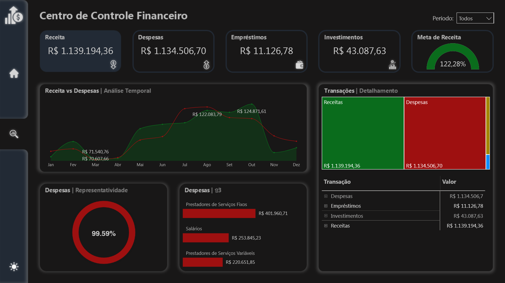

# 📊 Projeto Financeiro — Aureon Finance

## 📌 Visão Geral

Este projeto apresenta o **Aureon Finance**, um dashboard analítico desenvolvido em **Power BI** para **gestão financeira integrada**. O objetivo é consolidar receitas, despesas, empréstimos e investimentos em uma visão centralizada, facilitando o planejamento estratégico e a tomada de decisão financeira.

🔎 [Dashboard Interativo](https://app.powerbi.com/view?r=eyJrIjoiNDFjMzBkNzAtMmY3Zi00ZTdlLTkyMDktZmY3NzQ5Mzc5Y2NiIiwidCI6IjIzY2FjN2VlLWYxZDgtNDMzOS1hYTdiLTc4MWFhOWY5MjI1YiJ9)

---

# 🧠 Contexto do Problema

A gestão financeira pessoal ou corporativa frequentemente se torna complexa devido à **dispersão de informações** entre diferentes fontes. Isso dificulta a:

- visualização clara de receitas, despesas, investimentos e compromissos  
- análise integrada do fluxo financeiro  
- planejamento estratégico baseado em dados  

A ausência de um painel consolidado limita a capacidade de monitorar indicadores-chave de desempenho financeiro.

---

# 🎯 Abordagem Estratégica

O **dashboard Aureon Finance** foi desenvolvido com foco em **experiência interativa**:

- Capa com **menu lateral de navegação** e suporte a **Dark e Light Mode**  
- Acesso ao **Centro de Controle Financeiro**, que centraliza os principais indicadores  
- Foco em monitoramento de **receitas, despesas, empréstimos e investimentos** em uma visão integrada  

O objetivo é permitir que o usuário tenha **controle completo sobre os indicadores financeiros** de forma intuitiva e eficiente.

---

# 📊 Estrutura Analítica do Dashboard

### Indicadores Estratégicos

- Cartões: **Receita**, **Despesas**, **Empréstimos**, **Investimentos** e **Meta de Receita**  
- Percentual de despesas em relação à receita  

### Análise Temporal

- Gráfico de área comparando **Receita vs Despesas**, com destaque para meses de **maior e menor entrada/saída**  

### Análise Detalhada

- **Treemap** organizando receitas, despesas, investimentos e empréstimos  
- Gráfico de barras horizontais com **TOP3 maiores despesas**  
- Tabela detalhada das transações financeiras (despesas, empréstimos, investimentos e receitas)  

---

# 🛠️ Tecnologias Envolvidas

- **Power BI** — desenvolvimento das visualizações e storytelling financeiro  
- **DAX** — criação de medidas para indicadores financeiros e métricas percentuais  
- **Linguagem M** — transformação e preparação dos dados no Power Query  
- **Modelagem Dimensional** — organização das entidades financeiras e transacionais para consistência e escalabilidade  

---

# 📈 Conexão com Planejamento Financeiro

O Aureon Finance oferece:

- acompanhamento integrado do desempenho financeiro  
- identificação de padrões de gastos  
- apoio à tomada de decisão sobre investimentos e metas financeiras  
- alinhamento entre **organização financeira e prosperidade sustentável**  

---

# 📸 Preview do Dashboard

## Documentação das Medidas

Para consultar a documentação das medidas deste projeto, suas fórmulas e descrições, acesse a [Documentação das Medidas](docs/medidas-documentacao.md).

# 👨‍💻 Autor

Projeto desenvolvido como parte do meu portfólio profissional em **Business Intelligence e Data Analytics**, destacando habilidades avançadas e aplicáveis a diversos cenários analíticos:

- Desenvolvimento de **dashboards executivos e painéis estratégicos**, focados em insights acionáveis e tomada de decisão baseada em dados  
- **Modelagem dimensional e relacional**, aplicando corretamente **cardinalidade, granularidade** e hierarquias entre tabelas para garantir consistência e integridade dos dados  
- **Transformação de dados com Power Query e Linguagem M**, criando pipelines eficientes, automatizados e auditáveis  
- Criação de **KPIs estratégicos e métricas customizadas em DAX**, para análise de performance e comparações confiáveis  
- **Integração de múltiplas fontes de dados** (Excel, SQL, APIs, arquivos planos), padronizando e validando informações críticas  
- **Data storytelling e visualizações interativas**, com cores, hierarquias, filtros e destaque de insights, para facilitar interpretação e engajamento do usuário  
- **Análises estatísticas e preditivas**, usando Python, R, regressões, teste de hipóteses, séries temporais e técnicas de Machine Learning para identificação de tendências e padrões  
- **Automatização e otimização de processos analíticos**, incluindo ETL, scripts e compressão de dados, garantindo performance e escalabilidade dos relatórios  
- **Documentação detalhada de medidas, tabelas, modelos e processos**, permitindo reprodutibilidade, transparência e governança dos dados  
- Aplicação de **boas práticas de engenharia de dados**, integrando análise, estatística, IA e visualização para soluções analíticas completas e confiáveis  
- Domínio completo de **Power BI, DAX, Power Query, Python e R**, com foco em performance, qualidade e entrega de insights estratégicos

---

  
**Portfólio de Business Intelligence & Data Analytics**  

| [LinkedIn](https://www.linkedin.com/in/rogério-clynton-ribeiro/) | [Portfólio](https://clyntonboss.github.io/) |

